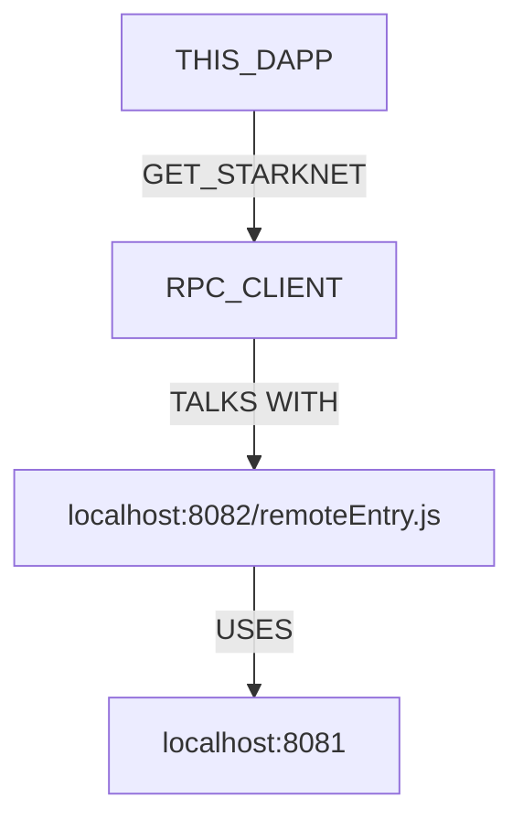

# Cairo1JS Local Enviornment Set up

## Presentation

This repo is a [fork](https://github.com/PhilippeR26/Cairo1JS/tree/main/src) used to demonstrates how StarkNet DAPP builders can create a local environment to test upcoming features/fixes of the StarkNet snap metamask extension.


The DAPP is made in the next.js framework, using the experimental **appDir** feature. Coded in Typescript. Using React, Zustand context & Chaka-ui components.

### Setting Up Local Test Environment for StarkNet MetaMask Snap with `get-starknet`

The `get-starknet` module communicates with the StarkNet Snap by utilizing a Webpack-fed module that serves as an RPC client. 
This client enables communication with the StarkNet Snap. Below we describe a way to set up this environment locally to facilitate the testing 
of upcoming features in the StarkNet Metamask Snap.

#### Environment Setup

The environment configuration is as follows:




This setup allows a StarkNet DAPP to test upcoming features in the MetaMask Snap locally before these changes are released. This early testing facilitates feedback during the iterative process with StarkNet DAPP builders.

To set up this local test environment for the StarkNet MetaMask Snap with `get-starknet`, follow these steps:

#### Part 1 : Metamask starknet-snap

1. Clone the StarkNet Snap repository:

```bash
git clone https://github.com/Consensys/starknet-snap.git
cd starknet-snap
yarn 
yarn setup 
```

2. Serve `packages/starknet-snap` locally:

For the local serving of `starknet-snap`, you need both 
- a Voyager Alchemy API key. 
- an Alchemy API key. 

Make sure to add the following to your `.env` file in the `packages/starknet-snap` of the `starknet-snap` repo.
You can use the `.env.example` file as a starting point.

```bash
cd packages/starknet-snap 
cp .env.example .env 
# Edit .env and populate voyager and alchemy key
yarn workspace @consensys/starknet-snap watch
```

3. Build and serve the `remoteEntry.js` (necessary for the get-starknet MetaMask bridge):

```bash
cd packages/get-starknet
cp .env.sample .env 
# No need to edit .env
yarn serve:fed:local
```

#### Part 2 : Starknet.io Get-starknet repo

4. Clone the `get-starknet` repository:

To get the multi wallet discovery feature we need to get the fork from `Consensys` because the 
change has not been merged in the upstream repo yet

```bash
git clone https://github.com/Consensys/get-starknet.git
cd get-starknet
git checkout feat/eip-6963
echo "SNAP_ID=local:http://localhost:8081" > .env
cp packages/core/.env.sample packages/core/.env
pnpm install 
pnpm run build 
cd packages/ui
yarn link 
# This will link a get-starknet package to be used in the next section. 
```

#### Part 3 : In this repo 

```bash
yarn
yarn link get-starknet 
cp .env.sample .env.local
# Edit .env.local to set a starknet RPC url (you can use the one you used in Part 1)
yarn dev
```
